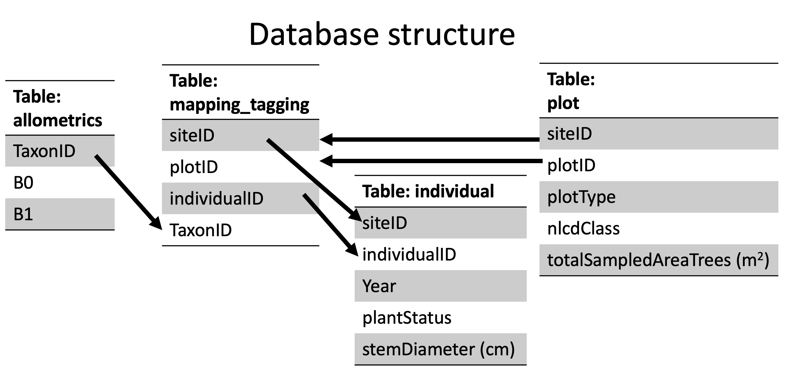
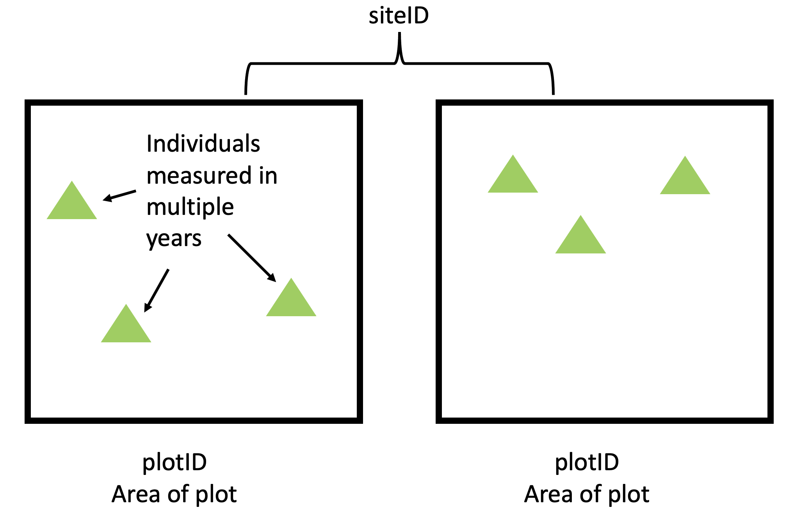
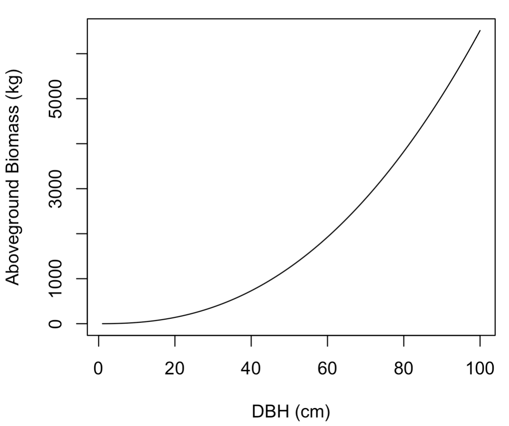
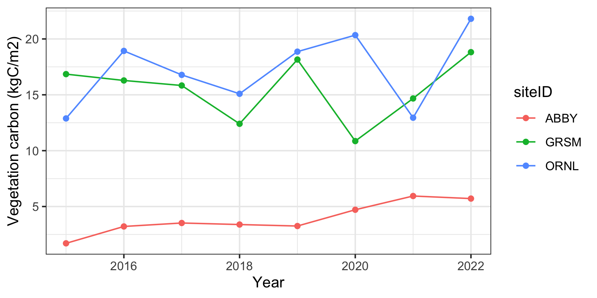
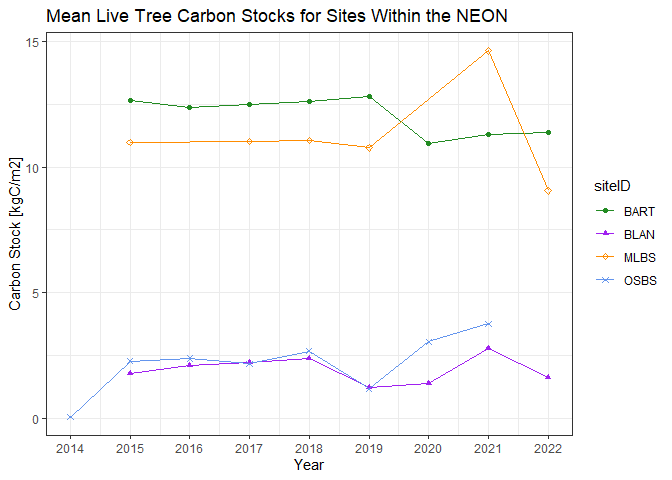

Forest Inventory
================
Quinn Thomas
2023-02-20

``` r
library(tidyverse)
```

    ## ── Attaching packages ─────────────────────────────────────── tidyverse 1.3.2 ──
    ## ✔ ggplot2 3.4.0      ✔ purrr   1.0.1 
    ## ✔ tibble  3.1.8      ✔ dplyr   1.0.10
    ## ✔ tidyr   1.3.0      ✔ stringr 1.5.0 
    ## ✔ readr   2.1.3      ✔ forcats 0.5.2 
    ## ── Conflicts ────────────────────────────────────────── tidyverse_conflicts() ──
    ## ✖ dplyr::filter() masks stats::filter()
    ## ✖ dplyr::lag()    masks stats::lag()

``` r
library(lubridate)
```

    ## Loading required package: timechange
    ## 
    ## Attaching package: 'lubridate'
    ## 
    ## The following objects are masked from 'package:base':
    ## 
    ##     date, intersect, setdiff, union

``` r
library(knitr)
library(DBI)
library(duckdb)
```

    ## Warning: package 'duckdb' was built under R version 4.2.3

## Science question

How much carbon is stored in a forest ecosystem and how does it differ
across the U.S.?

## Background on estimating carbon stocks

One common approach to estimating carbon in woody vegetation is by
measuring the diameter of each individual tree over a certain size in a
set area (called a plot). The diameter of each tree is converted to mass
(called biomass) using equations that use diameter to predict biomass
(called allometric relationships). Allometric relationships are
statistical relationships that are created by measuring a tree’s
diameter before cutting down and weighing it. A general relationship for
a species can be created by combining these harvested trees into a
single analysis. Allometric relationships typically estimate aboveground
biomass which needs to be converted to carbon by multiplying by 0.5
(biomass is about 50% carbon).

Total biomass of a tree is the sum of aboveground and belowground
carbon. Since belowground carbon is less commonly measured (it requires
digging up the tree roots), we can use ratios of aboveground to
belowground carbon from a limited set of trees where the entire tree was
extracted to calculate total tree tree carbon.

Once total tree carbon is calculated for each tree (i.e., units of kg C
per tree) in a plot, the density of carbon for each plot (i.e., kg C per
m2) is calculated by summing across the individual trees and dividing
the plot sum by the plot area.

## Your charge!

I am a client interested in the carbon storage in vegetation of
different ecosystems across the continental U.S. to guide my investment
in the [California Carbon
Market.](https://ww2.arb.ca.gov/our-work/programs/compliance-offset-program)

I need carbon stocks using measurements for the following sites within
the National Ecological Observatory Network. In particular, I am
interested in the following sites:

- Blandy Experimental Farm (siteID: BLAN)
- Bartlett Experimental Forest (siteID: BART)
- Mountain Lake Biological Station (siteID: MLBS)
- Ordway-Swisher Biological Station (siteID: OSBS)

## Part 1: Develop hypotheses

Explore the descriptions of our four focal NEON sites at
<https://www.neonscience.org/field-sites/field-sites-map/list>, how the
sites look on the satellite image in the site description, and your
general knowledge about ecosystem science to develop your hypothesized
for the following question:

**Question 1:** Based on information about location and ecosystem type,
rank the sites in order of 1 = most vegetation carbon, 4 = least
vegetation carbon. Provide a justification for your ranking.

**Answer 1: My rank for the sites in order from most vegetation carbon
to least vegetation carbon is BART (1), MLBS (2), OSBS (3), and BLAN
(4). The BART and MLBS sites have the greatest diversity of tree
species, which are better at storing carbon, due to their underbrush
being mainly trees. The BART site is predicted to have slightly higher
carbon in vegetation since the average temperature is cooler, which
facilitates greater carbon storage. The second lowest carbon storage
would be OSBS because there is a variety of trees present in this site,
but the underbrush is mostly shrubs and grass, which are not good at
storing carbon due to their short life cycle. The BLAN site was
predicted to have the lowest amount of carbon stored in vegetation
because, according to the NEON site, the area is a fallow scrub land
with hay crops, which are not known to store large amounts of carbon due
to their short life cycle. **

## Part 2: Download and Merge data products

This module uses data from the [National Ecological Observatory
Network](https://www.neonscience.org). Specifically, it uses the
Vegetation Structure data product:
[DP1.10098.001](https://data.neonscience.org/data-products/DP1.10098.001).

Working with data from NEON, and many other data sources, requires
working with data spread across different data tables. For example, one
table may include the climate data for a set of focal locations while
another table may include data collected on a visit to the site.
Higher-level analyses that use the climate data to understand the field
date require linking the two tables.

Furthermore, environmental data can be “big data”. There are many
definitions of big data but I will use a simple one: the computer memory
(RAM, not hard disk) required to store your data is bigger than your
computer. When using this “big data”, you will crash your computer if
you try to load or read in all the data at once.

Note: typical RAM on a laptop is 8 - 16 GB and Hard Disk is 500 - 1 TB
so you can store more on your hard disk than you can analyze in R.

### Working with databases in R

Databases are a solution. They allow you to load only the parts of the
data that you want to analyze into memory while leaving the rest on your
much larger hard disk.

In this module you will be working with the NEON data in a database
form. I have cleaned up the NEON data from the raw form into structure
that is better suited for learning how to work with databases and joins.
The data is real and the analysis that you will produce is genuine.

The database a collection of data tables stored a single file called
`neon.duckdb` in the `assignment/data` subdirectory.

You can learn more about databases in R
[here](https://r4ds.hadley.nz/databases.html) and about the particular
type of database called a
[DuckDB](https://r4ds.hadley.nz/databases.html#in-this-book)

First you need to
[connect](%5Bhttps://r4ds.hadley.nz/databases.html#in-this-book%5D) to
the database using the `dbConnect` function in the `DBI` package. You
need to tell it the type of database (`duckdb()`) and the directory of
the database file.  
\[<https://r4ds.hadley.nz/databases.html#in-this-book>\]

``` r
con <- dbConnect(duckdb(),
                 dbdir="data/neon.duckdb")
```

The connection does not load any data into memory for you to analyze.
The connections allows to start looking at the database before loading
data into memory.  
First, what tables are in the
[database](%5Bhttps://r4ds.hadley.nz/databases.html#in-this-book%5D)?

``` r
dbListTables(con)
```

    ## [1] "allometrics"     "domains"         "individual"      "mapping_tagging"
    ## [5] "plot"

To load data into memory for analysis as a dataframe (i.e., move the
data from hard disk to RAM), use the `tbl`
[function](https://r4ds.hadley.nz/databases.html#dbplyr-basics). It
requires the connection name and the table name

``` r
individual <- tbl(con, "individual")
```

Imagine that the individual table is huge (like every tree measured by
the Forest Service across the U.S.). We don’t want to use the `tbl`
function to load all the data into RAM because that will cause R to
crash.

Fortunately, R uses the concept of “lazy loading”. First you can look at
the `individual` table to get a preview of the table that looks like the
table.

``` r
individual
```

    ## # Source:   table<individual> [?? x 5]
    ## # Database: DuckDB 0.7.1 [lchia@Windows 10 x64:R 4.2.2/data/neon.duckdb]
    ##     year siteID individualID            plantStatus stemDiameter
    ##    <dbl> <chr>  <chr>                   <chr>              <dbl>
    ##  1  2022 SERC   NEON.PLA.D02.SERC.09748 Live                NA  
    ##  2  2022 SERC   NEON.PLA.D02.SERC.02833 Live                NA  
    ##  3  2022 SERC   NEON.PLA.D02.SERC.09668 Live                16.6
    ##  4  2022 SERC   NEON.PLA.D02.SERC.09875 Live                 1.6
    ##  5  2022 SERC   NEON.PLA.D02.SERC.08140 Live                 5.6
    ##  6  2022 SERC   NEON.PLA.D02.SERC.09752 Live                 2.7
    ##  7  2022 SERC   NEON.PLA.D02.SERC.08156 Live                 7.8
    ##  8  2022 SERC   NEON.PLA.D02.SERC.08151 Live                NA  
    ##  9  2022 SERC   NEON.PLA.D02.SERC.13361 Live                NA  
    ## 10  2022 SERC   NEON.PLA.D02.SERC.09749 Live                NA  
    ## # … with more rows

However, if you look deeper, it doesn’t have all the rows. The preview
seems to only have 1000 rows. In fact it does not have any rows

``` r
nrow(individual)
```

    ## [1] NA

This is because the data won’t be loaded into memory until you
specifically tell it to do so (hence being “lazy”). The [`collect()`
function](https://r4ds.hadley.nz/databases.html#dbplyr-basics) is what
finally pulls the data into memory. In the example below you can see
that there are now many rows of data.

``` r
individual <- tbl(con, "individual") |> 
  collect()
nrow(individual)
```

    ## [1] 136070

However, “collecting” the entire data table does not leverage the power
of using a database because it is pulling the entire data table into
memory. The advantage of using a database is that you can only load the
data that you actually need. In many cases you don’t need all rows or
columns of a data table for your analysis.

For example, the individual table has many more sites (`siteID`) than we
want.

``` r
individual |> distinct(siteID)
```

    ## # A tibble: 11 × 1
    ##    siteID
    ##    <chr> 
    ##  1 SERC  
    ##  2 UNDE  
    ##  3 GRSM  
    ##  4 BLAN  
    ##  5 MLBS  
    ##  6 BART  
    ##  7 ABBY  
    ##  8 ORNL  
    ##  9 OSBS  
    ## 10 DEJU  
    ## 11 TALL

You can `filter` only the rows you want before calling `collect`. Any
filtering or selecting before a collect call will reduce the size of the
data that you are actually moving from hard disk to RAM. The following
uses the `%in%` function to asks to keep data from any of the three
`siteID` values in the vector.

``` r
individual <- tbl(con, "individual") |> 
  filter(siteID %in% c("ABBY","GRSM", "ORNL")) |> 
  collect()
```

### Joining tables in R

Data in databases are spread across tables. This is done to help reduce
the size of the data. For example, if every tree is in a site and each
site is in domain, do we need to have a column for the domainID in the
same table as the individual trees? We could but adding the extra column
with a lot of repeated information (i.e., if there are 90 sites but
three domains then the same three domains will be repeated over and over
in the column) would require unnecessary use of storage and memory. Or
can we have the siteID in the tree table and another table that has the
domainID that each site belongs to? This would reduce the storage
requirement for the database. Therefore, databases use multiple tables.

However, what if you want to filter the trees by which domain they are
in? What if you want to average the trees at the domain scale? To do
this, you actually need a domain column in the same table as your trees.
“Joining” is how you combine the two tables together.

To explore joins, first load another table (domains table) and filter to
the sites that are desired.

``` r
neon_domains <- tbl(con, "domains") |> 
  filter(siteID %in% c("ABBY","GRSM", "ORNL")) |> 
  collect()
```

There are many types of joins: left_join, right_join, inner_join
full_join that differ in how they handle combining the tables. Read more
about joins [here](https://r4ds.hadley.nz/joins.html).

We are going to use a left join because we want to keep all the rows in
the table on the left of the function call (individual) and merge in the
matching data from the right table in the function call (neon_domains).
By using siteID as the matching key (`by = "siteID"`), we are assigning
the values in the other columns of the domains table (i.e., domainID) to
the rows with matching siteID. If there are rows in the left table
(individual) that don’t have matching siteIDs in the right table, the
join puts in NA for domainID in the left table. If there are multiple
rows in the right table that match a row in the left table in an error
occurs.

``` r
individual_domain <- left_join(individual, neon_domains, by = "siteID")
```

Again, the (`by = "siteID"`) is the matching key. There can be multiple
columns used to match (e.g. (`by = c("siteID", "individualID`)) if
necessary to correctly join two tables.

Following the left join, we can see that there is a new column called
`domainID`.

``` r
colnames(individual_domain)
```

    ## [1] "year"         "siteID"       "individualID" "plantStatus"  "stemDiameter"
    ## [6] "domainID"

We can also see that all rows for a siteID share the same domainID.

``` r
individual_domain |> filter(siteID == "ORNL") |> select(siteID, individualID, domainID)
```

    ## # A tibble: 12,371 × 3
    ##    siteID individualID             domainID
    ##    <chr>  <chr>                    <chr>   
    ##  1 ORNL   NEON.PLA.D07.ORNL.01675  D07     
    ##  2 ORNL   NEON.PLA.D07.ORNL.01672  D07     
    ##  3 ORNL   NEON.PLA.D07.ORNL.01588  D07     
    ##  4 ORNL   NEON.PLA.D07.ORNL.01568  D07     
    ##  5 ORNL   NEON.PLA.D07.ORNL.01635  D07     
    ##  6 ORNL   NEON.PLA.D07.ORNL.01601  D07     
    ##  7 ORNL   NEON.PLA.D07.ORNL.03051B D07     
    ##  8 ORNL   NEON.PLA.D07.ORNL.01642  D07     
    ##  9 ORNL   NEON.PLA.D07.ORNL.01632  D07     
    ## 10 ORNL   NEON.PLA.D07.ORNL.01679  D07     
    ## # … with 12,361 more rows

### String operations

One addition skill you will need to use the NEON data is the capacity to
filter using part of string. Thus far you have used strings to filter
like the following

``` r
individual_domain |> filter(domainID == "D07") |> 
  select(-plantStatus, -stemDiameter)
```

    ## # A tibble: 28,226 × 4
    ##     year siteID individualID            domainID
    ##    <dbl> <chr>  <chr>                   <chr>   
    ##  1  2022 GRSM   NEON.PLA.D07.GRSM.12664 D07     
    ##  2  2022 GRSM   NEON.PLA.D07.GRSM.12672 D07     
    ##  3  2022 GRSM   NEON.PLA.D07.GRSM.00758 D07     
    ##  4  2022 GRSM   NEON.PLA.D07.GRSM.00749 D07     
    ##  5  2022 GRSM   NEON.PLA.D07.GRSM.00715 D07     
    ##  6  2022 GRSM   NEON.PLA.D07.GRSM.00769 D07     
    ##  7  2022 GRSM   NEON.PLA.D07.GRSM.05020 D07     
    ##  8  2022 GRSM   NEON.PLA.D07.GRSM.03790 D07     
    ##  9  2022 GRSM   NEON.PLA.D07.GRSM.12669 D07     
    ## 10  2022 GRSM   NEON.PLA.D07.GRSM.00738 D07     
    ## # … with 28,216 more rows

However, often you want to filter by the presence of particular
characters in a string. For example, you have “Virginia
Tech”,“University of Virginia”, and “University of North Carolina” in
your dataset and you want to filter to keep only universities in
“Virginia”. Instead of doing the following:

    filter(university %in% c("Virginia Tech", "University of Virginia"))

you could filter on the presence of the word “Virginia” in the
university variable. To do this, you can use a function from the
[`stringr` package](https://r4ds.hadley.nz/strings.html) called
`str_detect()`. The function return TRUE or FALSE if the value for the
variable has that string in it. You then filter using the function

    filter(str_detect(university, "Virginia"))

Each tree has an individualID in the NEON data Imagine that we did not
have our table with domainID but you only wanted trees from domain 7
(`D07`). Notice how the individualID is a string and the string has the
domainID in it (example below is from the first row of the data).

``` r
individual$individualID[1]
```

    ## [1] "NEON.PLA.D07.GRSM.12664"

You can use the str_detect with a filter to only keep individuals that
are in domain 7 using the string `"D07"`. You can see in the code below
that only siteID from D07 remain the dataset.

``` r
individual_domain |> filter(str_detect(individualID, "D07"))
```

    ## # A tibble: 28,226 × 6
    ##     year siteID individualID            plantStatus              stemD…¹ domai…²
    ##    <dbl> <chr>  <chr>                   <chr>                      <dbl> <chr>  
    ##  1  2022 GRSM   NEON.PLA.D07.GRSM.12664 Live                        NA   D07    
    ##  2  2022 GRSM   NEON.PLA.D07.GRSM.12672 Live, physically damaged    NA   D07    
    ##  3  2022 GRSM   NEON.PLA.D07.GRSM.00758 Live                         1.1 D07    
    ##  4  2022 GRSM   NEON.PLA.D07.GRSM.00749 Live                        NA   D07    
    ##  5  2022 GRSM   NEON.PLA.D07.GRSM.00715 Live                         1.9 D07    
    ##  6  2022 GRSM   NEON.PLA.D07.GRSM.00769 Live, physically damaged    10.9 D07    
    ##  7  2022 GRSM   NEON.PLA.D07.GRSM.05020 Lost, presumed dead         NA   D07    
    ##  8  2022 GRSM   NEON.PLA.D07.GRSM.03790 Live                        NA   D07    
    ##  9  2022 GRSM   NEON.PLA.D07.GRSM.12669 Live                        NA   D07    
    ## 10  2022 GRSM   NEON.PLA.D07.GRSM.00738 Downed                      NA   D07    
    ## # … with 28,216 more rows, and abbreviated variable names ¹​stemDiameter,
    ## #   ²​domainID

The stringr package has many other useful functions for working with
strings. For example,
[`separate_wider_delim`](https://r4ds.hadley.nz/strings.html#sec-string-columns)
can be used to separate the individualID into its components.

``` r
 individual_domain |> 
  separate_wider_delim(
    individualID,
    delim = ".",
    names = c("NEON", "data_type", "new_domainID","new_siteID","individual_tag")
  )
```

    ## # A tibble: 38,845 × 10
    ##     year siteID NEON  data_type new_do…¹ new_s…² indiv…³ plant…⁴ stemD…⁵ domai…⁶
    ##    <dbl> <chr>  <chr> <chr>     <chr>    <chr>   <chr>   <chr>     <dbl> <chr>  
    ##  1  2022 GRSM   NEON  PLA       D07      GRSM    12664   Live       NA   D07    
    ##  2  2022 GRSM   NEON  PLA       D07      GRSM    12672   Live, …    NA   D07    
    ##  3  2022 GRSM   NEON  PLA       D07      GRSM    00758   Live        1.1 D07    
    ##  4  2022 GRSM   NEON  PLA       D07      GRSM    00749   Live       NA   D07    
    ##  5  2022 GRSM   NEON  PLA       D07      GRSM    00715   Live        1.9 D07    
    ##  6  2022 GRSM   NEON  PLA       D07      GRSM    00769   Live, …    10.9 D07    
    ##  7  2022 GRSM   NEON  PLA       D07      GRSM    05020   Lost, …    NA   D07    
    ##  8  2022 GRSM   NEON  PLA       D07      GRSM    03790   Live       NA   D07    
    ##  9  2022 GRSM   NEON  PLA       D07      GRSM    12669   Live       NA   D07    
    ## 10  2022 GRSM   NEON  PLA       D07      GRSM    00738   Downed     NA   D07    
    ## # … with 38,835 more rows, and abbreviated variable names ¹​new_domainID,
    ## #   ²​new_siteID, ³​individual_tag, ⁴​plantStatus, ⁵​stemDiameter, ⁶​domainID

or maybe you just want only the NEON part. You can use `str_sub` to
subset only the first 4 characters of the string. The start is the first
position in the string you want to keep and the end is the last position
you want to keep.

``` r
individual_domain |> 
  mutate(project = str_sub(individualID, start = 1, end = 4)) |> 
  select(project, individualID)
```

    ## # A tibble: 38,845 × 2
    ##    project individualID           
    ##    <chr>   <chr>                  
    ##  1 NEON    NEON.PLA.D07.GRSM.12664
    ##  2 NEON    NEON.PLA.D07.GRSM.12672
    ##  3 NEON    NEON.PLA.D07.GRSM.00758
    ##  4 NEON    NEON.PLA.D07.GRSM.00749
    ##  5 NEON    NEON.PLA.D07.GRSM.00715
    ##  6 NEON    NEON.PLA.D07.GRSM.00769
    ##  7 NEON    NEON.PLA.D07.GRSM.05020
    ##  8 NEON    NEON.PLA.D07.GRSM.03790
    ##  9 NEON    NEON.PLA.D07.GRSM.12669
    ## 10 NEON    NEON.PLA.D07.GRSM.00738
    ## # … with 38,835 more rows

Overall, the `stringr` package in the tidyverse is very useful for
working with strings in data frames. You can learn more
[here](https://r4ds.hadley.nz/strings.html#subsetting)

## Part 3: Examine data

The database you will be analyzing has five tables but you will be
focusing on four of them (the domain table was just for demonstration
above). The structure of the data described in the figure below. The
arrows designate the different “keys” that link across the tables. The
other variables are the data in the tables that you will use for the
analysis.



- When and individual tree is first measured in a plot (`plotID`) it is
  given an `individualID` and a species identification (`taxonID`). This
  is saved in the mapping_tagging table.  
- Each time a tree (`individualID`) is measured the date of measurement
  is recorded (`Year`), the status (`plantStatus`) of the tree (is it
  alive or dead), and the diameter (in centimeters) of the stem at
  breast height (`stemDiameter`). This is saved in the individual
  table.  
- Each plot (`plotID`) is within a site (`siteID`). Each plot has a
  `plotType` to designate where in the site it is located (i.e., around
  the center measurement tower), the vegetation class of the plot is
  recorded (`nlcdClass`), and the area (in square meters) of the plot is
  recorded (`totalSampledAreaTrees`). This is saved in the plot table.

The figure below is diagrams this NEON data collection design.


- Across the U.S. in non-NEON sites, researchers have measured trees
  diameters and cut down the trees to weight them. For each species
  (`taxonID`), they then develop equations that use diameter (in
  centimeters) to predict the weight (biomass). The equation has two
  parameters (`B0` and `B1`). This is saved in the allometrics table.
  The figure below is an example relations between diameter and biomass.
  The equation for converting diameter to biomass is at the bottom of
  Table 4 in Jenkins et al. 2003.



## Part 4: Calculate carbon in live trees

This step will challenge you to develop a workflow using the data
science skills to calculate the carbon stocks in live trees at each of
the four sites. For each site, you should have a **site-level** mean
carbon stock in **live trees** for **each year** with measurements. Your
estimate will be from the plots that are sampling the ecosystem under
the flux tower - called **tower** plots. See
<https://www.neonscience.org/field-sites/field-sites-map/BART> for an
example map of a plot with the tower plots labeled (Tower Base Plot)

Hints for calculating carbon in live trees:

- The `plantStatus` column has whether the tree was alive at the time of
  measurement, but there are multiple types of live trees. Be sure your
  analysis includes all the types of live trees. You may need to use
  string manipulation and filter functions in the `stringr` package.  
- The Climate Action Reserve project (an official carbon accounting
  organization for the California Carbon Exchange) provides allometric
  relationships to use to calculate **aboveground biomass**. The
  allometric equations for each species can be found in the
  “allometrics” table. You will need to **join** the parameters (B0 and
  B1) in “allometrics” to your table with the diameter measurements. The
  parameters we use come from Table 4 in the Jenkins et al. 2003 in the
  assignments directory. The equation for converting diameter to biomass
  is at the bottom of Table 4 in Jenkins et al. 2003.
- After calculating the aboveground biomass, you will need to calculate
  the belowground biomass (i.e., roots). Belowground biomass is assumed
  to be 30% of aboveground biomass Be sure to add this additional
  biomass to your calculation of vegetation biomass.
- Remember that only 50% of biomass is carbon so you will need to
  convert from biomass to carbon.  
- The **site level** value in each year is the mean of the plots at the
  site. Don’t forget that we are only interested in the “Tower” plots.
- Be very careful with the units at each step: the final units should be
  kgC m^-2 (Kilogram of carbon per meter squared). The order of
  magnitude should be 1 - 100.

Remember to review the description in **Background on estimating carbon
stocks** about how to calculate carbon stocks.

Calculate the vegetation carbon stocks of each site for each year using
the following steps:

**Question 2:** Using join functions to create a table with the
following columns: `siteID`, `plotID`, `individualID`,`taxonID`, `year`,
`plantStatus`, `stemDiameter`,`B0`, `B1`.

- Blandy Experimental Farm (siteID: BLAN)
- Bartlett Experimental Forest (siteID: BART)
- Mountain Lake Biological Station (siteID: MLBS)
- Ordway-Swisher Biological Station (siteID: OSBS)

**Answer 2: code chunk below. **

``` r
#filtering specific 4 site IDs
individual <- tbl(con, "individual") |> 
  filter(siteID %in% c("BLAN","BART", "MLBS", "OSBS")) |> 
  collect()

#adding taxonID & plotID
neon_taxon <- tbl(con, "mapping_tagging") |> 
  filter(siteID %in% c("BLAN","BART", "MLBS", "OSBS")) |> 
  collect()

individual_mapping <- 
  left_join(individual, neon_taxon, by = c("siteID", "individualID")) 

#adding B0 and B1
taxons <- individual_mapping %>% 
  distinct(taxonID) %>% 
  pull(taxonID) %>% 
  as.character()

neon_parameters <- tbl(con, "allometrics") |> 
  filter(taxonID %in% taxons) |> 
  collect()

individual_allometrics <- left_join(individual_mapping, neon_parameters, by = c("taxonID"))

individual_final <- individual_allometrics |> 
  filter(str_detect(plantStatus, "Live"))
```

**Question 3:** Using the table from Question 2, calculate the carbon of
each tree that is alive in each plotID - year combination following the
instructions above. biomass equation: bm = Exp(B0 + B1\*ln(dbh)) - bm =
total aboveground biomass (kg) for trees 2.5 cm dbh and larger - dbh =
diameter at breast height (cm) - Exp = exponential function - ln =
natural log base “e”

**Answer 3: code chunk below**

``` r
#calculating the carbon of each tree
individual_final <- individual_final |> mutate(carbon = 0.5*(exp(B0 + B1*log(stemDiameter))))
```

**Question 4:** Using the table from Question 3, calculate the total
carbon of each plot in each year. Your columns should be: `siteID`.
`plotID`, `carbon`, `year`

**Answer 4: code chunk below. **

``` r
#grouping every plotID - year combo
individual_grouped <- individual_final |> 
  group_by(year, plotID, siteID) |> 
  summarize(carbon = sum(carbon, na.rm = TRUE)) |> 
  select(year, plotID, siteID, carbon)
```

    ## `summarise()` has grouped output by 'year', 'plotID'. You can override using
    ## the `.groups` argument.

**Question 5:** Using the table from Question 4, use a join to associate
a plot area and plot type with each plot. Your columns should be:
`siteID`, `plotID`, `carbon`, `plotType`, `totalSampledAreaTrees`,
`year`

``` r
neon_plot <- tbl(con, "plot") |> 
  filter(siteID %in% c("BLAN","BART", "MLBS", "OSBS")) |> 
  collect()

individual_plot <- 
  left_join(individual_grouped, neon_plot, by = c("siteID", "plotID")) |> 
  select(year, plotID, siteID, plotType, carbon, totalSampledAreaTrees) |>
  filter(plotType == "tower")
```

**Question 6:** Using the table from Question 5, Divide the plot carbon
by the plot area. Also, make sure you only have the type of plot we
want.

``` r
individual_plot <-
  individual_plot |> mutate(carbonBYarea = carbon/totalSampledAreaTrees)
```

**Question 7:** Using the table Question 6, average the plots within a
site/year combination to get site level carbon for each ???

``` r
individual_grouped2 <- individual_plot |> 
  group_by(year, siteID) |> 
  summarize(carbon = mean(carbonBYarea, na.rm = TRUE)) |> 
  select(year, siteID, carbon)
```

    ## `summarise()` has grouped output by 'year'. You can override using the
    ## `.groups` argument.

## Part 4: Create report

I am looking for the following plots, tables, and text in the Rmarkdown
document:

**Question 8:** Generate a figure showing the mean live tree carbon
stocks in each site and year. You will have year on the axis and carbon
stocks on the y-axis with different lines for each site. Be sure your
figures are complete with units, labels, and a title. Here is an example
of the plot for a different set of sites.



**Answer 8:**

``` r
site_colors <- c("BLAN" = "purple", "BART" = "forestgreen", "MLBS" = "darkorange", "OSBS" = "cornflowerblue")

# Create the plot
individual_grouped2 |> 
  ggplot(aes(year, carbon, color = siteID, shape = siteID)) + 
  geom_line() +
  geom_point() +
  scale_x_continuous(breaks = seq(2014, 2022, by = 1)) +
  scale_color_manual(values = site_colors) +  
  scale_shape_manual(values = c(19, 17, 23, 4)) +
  theme_bw() +
  labs(title = "Mean Live Tree Carbon Stocks for Sites Within the NEON",
       x = "Year",
       y = "Carbon Stock [kgC/m2]")
```

<!-- -->

**Question 9:** Generate a table of values for the site level carbon
stocks averaged across years and plots (I recommend using the `kable()`
function to generate a clean looking table).

**Answer 9:**

``` r
#group_by
ktable <- individual_plot |> 
  group_by(year, plotID) |> 
  summarize(mean_carbon = mean(carbonBYarea))
```

    ## `summarise()` has grouped output by 'year'. You can override using the
    ## `.groups` argument.

``` r
# Print the table using kable
library(kableExtra)
```

    ## Warning: package 'kableExtra' was built under R version 4.2.3

    ## 
    ## Attaching package: 'kableExtra'
    ## 
    ## The following object is masked from 'package:dplyr':
    ## 
    ##     group_rows

``` r
kable(ktable, col.names = c("Year", "Plot ID", "Average Carbon Stock [kgC/m2]"))
```

<table>
<thead>
<tr>
<th style="text-align:right;">
Year
</th>
<th style="text-align:left;">
Plot ID
</th>
<th style="text-align:right;">
Average Carbon Stock \[kgC/m2\]
</th>
</tr>
</thead>
<tbody>
<tr>
<td style="text-align:right;">
2014
</td>
<td style="text-align:left;">
OSBS_025
</td>
<td style="text-align:right;">
0.0079537
</td>
</tr>
<tr>
<td style="text-align:right;">
2014
</td>
<td style="text-align:left;">
OSBS_027
</td>
<td style="text-align:right;">
0.2118359
</td>
</tr>
<tr>
<td style="text-align:right;">
2014
</td>
<td style="text-align:left;">
OSBS_033
</td>
<td style="text-align:right;">
0.0148271
</td>
</tr>
<tr>
<td style="text-align:right;">
2014
</td>
<td style="text-align:left;">
OSBS_035
</td>
<td style="text-align:right;">
0.0185413
</td>
</tr>
<tr>
<td style="text-align:right;">
2014
</td>
<td style="text-align:left;">
OSBS_040
</td>
<td style="text-align:right;">
0.0001894
</td>
</tr>
<tr>
<td style="text-align:right;">
2015
</td>
<td style="text-align:left;">
BART_032
</td>
<td style="text-align:right;">
11.3172315
</td>
</tr>
<tr>
<td style="text-align:right;">
2015
</td>
<td style="text-align:left;">
BART_033
</td>
<td style="text-align:right;">
8.6877294
</td>
</tr>
<tr>
<td style="text-align:right;">
2015
</td>
<td style="text-align:left;">
BART_034
</td>
<td style="text-align:right;">
12.3115666
</td>
</tr>
<tr>
<td style="text-align:right;">
2015
</td>
<td style="text-align:left;">
BART_036
</td>
<td style="text-align:right;">
9.7131032
</td>
</tr>
<tr>
<td style="text-align:right;">
2015
</td>
<td style="text-align:left;">
BART_037
</td>
<td style="text-align:right;">
13.0044974
</td>
</tr>
<tr>
<td style="text-align:right;">
2015
</td>
<td style="text-align:left;">
BART_039
</td>
<td style="text-align:right;">
11.0596716
</td>
</tr>
<tr>
<td style="text-align:right;">
2015
</td>
<td style="text-align:left;">
BART_040
</td>
<td style="text-align:right;">
11.3210414
</td>
</tr>
<tr>
<td style="text-align:right;">
2015
</td>
<td style="text-align:left;">
BART_041
</td>
<td style="text-align:right;">
13.7964822
</td>
</tr>
<tr>
<td style="text-align:right;">
2015
</td>
<td style="text-align:left;">
BART_042
</td>
<td style="text-align:right;">
12.7152819
</td>
</tr>
<tr>
<td style="text-align:right;">
2015
</td>
<td style="text-align:left;">
BART_044
</td>
<td style="text-align:right;">
10.8209404
</td>
</tr>
<tr>
<td style="text-align:right;">
2015
</td>
<td style="text-align:left;">
BART_046
</td>
<td style="text-align:right;">
12.7999368
</td>
</tr>
<tr>
<td style="text-align:right;">
2015
</td>
<td style="text-align:left;">
BART_047
</td>
<td style="text-align:right;">
14.9019414
</td>
</tr>
<tr>
<td style="text-align:right;">
2015
</td>
<td style="text-align:left;">
BART_050
</td>
<td style="text-align:right;">
14.9761089
</td>
</tr>
<tr>
<td style="text-align:right;">
2015
</td>
<td style="text-align:left;">
BART_051
</td>
<td style="text-align:right;">
16.9418024
</td>
</tr>
<tr>
<td style="text-align:right;">
2015
</td>
<td style="text-align:left;">
BART_070
</td>
<td style="text-align:right;">
17.0432218
</td>
</tr>
<tr>
<td style="text-align:right;">
2015
</td>
<td style="text-align:left;">
BART_071
</td>
<td style="text-align:right;">
7.2090604
</td>
</tr>
<tr>
<td style="text-align:right;">
2015
</td>
<td style="text-align:left;">
BART_072
</td>
<td style="text-align:right;">
14.6769724
</td>
</tr>
<tr>
<td style="text-align:right;">
2015
</td>
<td style="text-align:left;">
BART_073
</td>
<td style="text-align:right;">
11.4615181
</td>
</tr>
<tr>
<td style="text-align:right;">
2015
</td>
<td style="text-align:left;">
BART_074
</td>
<td style="text-align:right;">
13.1493887
</td>
</tr>
<tr>
<td style="text-align:right;">
2015
</td>
<td style="text-align:left;">
BART_075
</td>
<td style="text-align:right;">
14.7107477
</td>
</tr>
<tr>
<td style="text-align:right;">
2015
</td>
<td style="text-align:left;">
BLAN_032
</td>
<td style="text-align:right;">
0.0539313
</td>
</tr>
<tr>
<td style="text-align:right;">
2015
</td>
<td style="text-align:left;">
BLAN_035
</td>
<td style="text-align:right;">
0.3944695
</td>
</tr>
<tr>
<td style="text-align:right;">
2015
</td>
<td style="text-align:left;">
BLAN_036
</td>
<td style="text-align:right;">
1.5430197
</td>
</tr>
<tr>
<td style="text-align:right;">
2015
</td>
<td style="text-align:left;">
BLAN_041
</td>
<td style="text-align:right;">
0.0421011
</td>
</tr>
<tr>
<td style="text-align:right;">
2015
</td>
<td style="text-align:left;">
BLAN_044
</td>
<td style="text-align:right;">
0.1842388
</td>
</tr>
<tr>
<td style="text-align:right;">
2015
</td>
<td style="text-align:left;">
BLAN_047
</td>
<td style="text-align:right;">
1.4227528
</td>
</tr>
<tr>
<td style="text-align:right;">
2015
</td>
<td style="text-align:left;">
BLAN_048
</td>
<td style="text-align:right;">
6.8797758
</td>
</tr>
<tr>
<td style="text-align:right;">
2015
</td>
<td style="text-align:left;">
BLAN_050
</td>
<td style="text-align:right;">
0.1345480
</td>
</tr>
<tr>
<td style="text-align:right;">
2015
</td>
<td style="text-align:left;">
BLAN_052
</td>
<td style="text-align:right;">
0.4316205
</td>
</tr>
<tr>
<td style="text-align:right;">
2015
</td>
<td style="text-align:left;">
BLAN_053
</td>
<td style="text-align:right;">
0.0483658
</td>
</tr>
<tr>
<td style="text-align:right;">
2015
</td>
<td style="text-align:left;">
BLAN_055
</td>
<td style="text-align:right;">
0.0311783
</td>
</tr>
<tr>
<td style="text-align:right;">
2015
</td>
<td style="text-align:left;">
BLAN_057
</td>
<td style="text-align:right;">
0.1585124
</td>
</tr>
<tr>
<td style="text-align:right;">
2015
</td>
<td style="text-align:left;">
BLAN_063
</td>
<td style="text-align:right;">
11.8337973
</td>
</tr>
<tr>
<td style="text-align:right;">
2015
</td>
<td style="text-align:left;">
MLBS_061
</td>
<td style="text-align:right;">
9.8410325
</td>
</tr>
<tr>
<td style="text-align:right;">
2015
</td>
<td style="text-align:left;">
MLBS_062
</td>
<td style="text-align:right;">
10.1403216
</td>
</tr>
<tr>
<td style="text-align:right;">
2015
</td>
<td style="text-align:left;">
MLBS_063
</td>
<td style="text-align:right;">
11.1109831
</td>
</tr>
<tr>
<td style="text-align:right;">
2015
</td>
<td style="text-align:left;">
MLBS_064
</td>
<td style="text-align:right;">
9.7412888
</td>
</tr>
<tr>
<td style="text-align:right;">
2015
</td>
<td style="text-align:left;">
MLBS_065
</td>
<td style="text-align:right;">
12.8522830
</td>
</tr>
<tr>
<td style="text-align:right;">
2015
</td>
<td style="text-align:left;">
MLBS_066
</td>
<td style="text-align:right;">
10.9456634
</td>
</tr>
<tr>
<td style="text-align:right;">
2015
</td>
<td style="text-align:left;">
MLBS_067
</td>
<td style="text-align:right;">
7.8761547
</td>
</tr>
<tr>
<td style="text-align:right;">
2015
</td>
<td style="text-align:left;">
MLBS_068
</td>
<td style="text-align:right;">
12.8061587
</td>
</tr>
<tr>
<td style="text-align:right;">
2015
</td>
<td style="text-align:left;">
MLBS_069
</td>
<td style="text-align:right;">
10.8632095
</td>
</tr>
<tr>
<td style="text-align:right;">
2015
</td>
<td style="text-align:left;">
MLBS_070
</td>
<td style="text-align:right;">
9.4292124
</td>
</tr>
<tr>
<td style="text-align:right;">
2015
</td>
<td style="text-align:left;">
MLBS_071
</td>
<td style="text-align:right;">
15.4211188
</td>
</tr>
<tr>
<td style="text-align:right;">
2015
</td>
<td style="text-align:left;">
MLBS_072
</td>
<td style="text-align:right;">
7.5649179
</td>
</tr>
<tr>
<td style="text-align:right;">
2015
</td>
<td style="text-align:left;">
MLBS_073
</td>
<td style="text-align:right;">
14.5015903
</td>
</tr>
<tr>
<td style="text-align:right;">
2015
</td>
<td style="text-align:left;">
MLBS_074
</td>
<td style="text-align:right;">
12.5278277
</td>
</tr>
<tr>
<td style="text-align:right;">
2015
</td>
<td style="text-align:left;">
MLBS_075
</td>
<td style="text-align:right;">
11.0443990
</td>
</tr>
<tr>
<td style="text-align:right;">
2015
</td>
<td style="text-align:left;">
MLBS_076
</td>
<td style="text-align:right;">
8.8622625
</td>
</tr>
<tr>
<td style="text-align:right;">
2015
</td>
<td style="text-align:left;">
OSBS_025
</td>
<td style="text-align:right;">
0.8928873
</td>
</tr>
<tr>
<td style="text-align:right;">
2015
</td>
<td style="text-align:left;">
OSBS_026
</td>
<td style="text-align:right;">
3.0590747
</td>
</tr>
<tr>
<td style="text-align:right;">
2015
</td>
<td style="text-align:left;">
OSBS_027
</td>
<td style="text-align:right;">
2.8464646
</td>
</tr>
<tr>
<td style="text-align:right;">
2015
</td>
<td style="text-align:left;">
OSBS_028
</td>
<td style="text-align:right;">
0.8773557
</td>
</tr>
<tr>
<td style="text-align:right;">
2015
</td>
<td style="text-align:left;">
OSBS_029
</td>
<td style="text-align:right;">
2.8606532
</td>
</tr>
<tr>
<td style="text-align:right;">
2015
</td>
<td style="text-align:left;">
OSBS_030
</td>
<td style="text-align:right;">
2.5778249
</td>
</tr>
<tr>
<td style="text-align:right;">
2015
</td>
<td style="text-align:left;">
OSBS_031
</td>
<td style="text-align:right;">
1.8499033
</td>
</tr>
<tr>
<td style="text-align:right;">
2015
</td>
<td style="text-align:left;">
OSBS_032
</td>
<td style="text-align:right;">
2.2858587
</td>
</tr>
<tr>
<td style="text-align:right;">
2015
</td>
<td style="text-align:left;">
OSBS_033
</td>
<td style="text-align:right;">
2.8352768
</td>
</tr>
<tr>
<td style="text-align:right;">
2015
</td>
<td style="text-align:left;">
OSBS_034
</td>
<td style="text-align:right;">
4.2831451
</td>
</tr>
<tr>
<td style="text-align:right;">
2015
</td>
<td style="text-align:left;">
OSBS_035
</td>
<td style="text-align:right;">
1.3537521
</td>
</tr>
<tr>
<td style="text-align:right;">
2015
</td>
<td style="text-align:left;">
OSBS_036
</td>
<td style="text-align:right;">
2.1308494
</td>
</tr>
<tr>
<td style="text-align:right;">
2015
</td>
<td style="text-align:left;">
OSBS_037
</td>
<td style="text-align:right;">
0.7901788
</td>
</tr>
<tr>
<td style="text-align:right;">
2015
</td>
<td style="text-align:left;">
OSBS_038
</td>
<td style="text-align:right;">
2.6288389
</td>
</tr>
<tr>
<td style="text-align:right;">
2015
</td>
<td style="text-align:left;">
OSBS_039
</td>
<td style="text-align:right;">
1.4698491
</td>
</tr>
<tr>
<td style="text-align:right;">
2015
</td>
<td style="text-align:left;">
OSBS_040
</td>
<td style="text-align:right;">
3.4056699
</td>
</tr>
<tr>
<td style="text-align:right;">
2015
</td>
<td style="text-align:left;">
OSBS_041
</td>
<td style="text-align:right;">
1.5373546
</td>
</tr>
<tr>
<td style="text-align:right;">
2015
</td>
<td style="text-align:left;">
OSBS_042
</td>
<td style="text-align:right;">
1.5087359
</td>
</tr>
<tr>
<td style="text-align:right;">
2015
</td>
<td style="text-align:left;">
OSBS_043
</td>
<td style="text-align:right;">
2.2112938
</td>
</tr>
<tr>
<td style="text-align:right;">
2015
</td>
<td style="text-align:left;">
OSBS_044
</td>
<td style="text-align:right;">
4.2030309
</td>
</tr>
<tr>
<td style="text-align:right;">
2016
</td>
<td style="text-align:left;">
BART_032
</td>
<td style="text-align:right;">
12.3266900
</td>
</tr>
<tr>
<td style="text-align:right;">
2016
</td>
<td style="text-align:left;">
BART_033
</td>
<td style="text-align:right;">
8.9081674
</td>
</tr>
<tr>
<td style="text-align:right;">
2016
</td>
<td style="text-align:left;">
BART_034
</td>
<td style="text-align:right;">
12.3600609
</td>
</tr>
<tr>
<td style="text-align:right;">
2016
</td>
<td style="text-align:left;">
BART_036
</td>
<td style="text-align:right;">
7.6652840
</td>
</tr>
<tr>
<td style="text-align:right;">
2016
</td>
<td style="text-align:left;">
BART_037
</td>
<td style="text-align:right;">
13.2644232
</td>
</tr>
<tr>
<td style="text-align:right;">
2016
</td>
<td style="text-align:left;">
BART_039
</td>
<td style="text-align:right;">
10.5674405
</td>
</tr>
<tr>
<td style="text-align:right;">
2016
</td>
<td style="text-align:left;">
BART_040
</td>
<td style="text-align:right;">
11.9066512
</td>
</tr>
<tr>
<td style="text-align:right;">
2016
</td>
<td style="text-align:left;">
BART_041
</td>
<td style="text-align:right;">
13.7633474
</td>
</tr>
<tr>
<td style="text-align:right;">
2016
</td>
<td style="text-align:left;">
BART_042
</td>
<td style="text-align:right;">
12.6941188
</td>
</tr>
<tr>
<td style="text-align:right;">
2016
</td>
<td style="text-align:left;">
BART_044
</td>
<td style="text-align:right;">
10.2455062
</td>
</tr>
<tr>
<td style="text-align:right;">
2016
</td>
<td style="text-align:left;">
BART_046
</td>
<td style="text-align:right;">
13.1975299
</td>
</tr>
<tr>
<td style="text-align:right;">
2016
</td>
<td style="text-align:left;">
BART_047
</td>
<td style="text-align:right;">
10.0073825
</td>
</tr>
<tr>
<td style="text-align:right;">
2016
</td>
<td style="text-align:left;">
BART_050
</td>
<td style="text-align:right;">
14.9471586
</td>
</tr>
<tr>
<td style="text-align:right;">
2016
</td>
<td style="text-align:left;">
BART_051
</td>
<td style="text-align:right;">
17.3748064
</td>
</tr>
<tr>
<td style="text-align:right;">
2016
</td>
<td style="text-align:left;">
BART_070
</td>
<td style="text-align:right;">
15.7174664
</td>
</tr>
<tr>
<td style="text-align:right;">
2016
</td>
<td style="text-align:left;">
BART_071
</td>
<td style="text-align:right;">
8.1509438
</td>
</tr>
<tr>
<td style="text-align:right;">
2016
</td>
<td style="text-align:left;">
BART_072
</td>
<td style="text-align:right;">
14.4527129
</td>
</tr>
<tr>
<td style="text-align:right;">
2016
</td>
<td style="text-align:left;">
BART_073
</td>
<td style="text-align:right;">
11.5861265
</td>
</tr>
<tr>
<td style="text-align:right;">
2016
</td>
<td style="text-align:left;">
BART_074
</td>
<td style="text-align:right;">
14.1650918
</td>
</tr>
<tr>
<td style="text-align:right;">
2016
</td>
<td style="text-align:left;">
BART_075
</td>
<td style="text-align:right;">
14.3822354
</td>
</tr>
<tr>
<td style="text-align:right;">
2016
</td>
<td style="text-align:left;">
BLAN_032
</td>
<td style="text-align:right;">
0.1060627
</td>
</tr>
<tr>
<td style="text-align:right;">
2016
</td>
<td style="text-align:left;">
BLAN_035
</td>
<td style="text-align:right;">
0.6831157
</td>
</tr>
<tr>
<td style="text-align:right;">
2016
</td>
<td style="text-align:left;">
BLAN_036
</td>
<td style="text-align:right;">
1.5601777
</td>
</tr>
<tr>
<td style="text-align:right;">
2016
</td>
<td style="text-align:left;">
BLAN_044
</td>
<td style="text-align:right;">
0.3746573
</td>
</tr>
<tr>
<td style="text-align:right;">
2016
</td>
<td style="text-align:left;">
BLAN_047
</td>
<td style="text-align:right;">
1.6741842
</td>
</tr>
<tr>
<td style="text-align:right;">
2016
</td>
<td style="text-align:left;">
BLAN_048
</td>
<td style="text-align:right;">
6.9076927
</td>
</tr>
<tr>
<td style="text-align:right;">
2016
</td>
<td style="text-align:left;">
BLAN_050
</td>
<td style="text-align:right;">
0.3819186
</td>
</tr>
<tr>
<td style="text-align:right;">
2016
</td>
<td style="text-align:left;">
BLAN_052
</td>
<td style="text-align:right;">
0.6004809
</td>
</tr>
<tr>
<td style="text-align:right;">
2016
</td>
<td style="text-align:left;">
BLAN_053
</td>
<td style="text-align:right;">
0.0828294
</td>
</tr>
<tr>
<td style="text-align:right;">
2016
</td>
<td style="text-align:left;">
BLAN_055
</td>
<td style="text-align:right;">
0.0115612
</td>
</tr>
<tr>
<td style="text-align:right;">
2016
</td>
<td style="text-align:left;">
BLAN_057
</td>
<td style="text-align:right;">
0.2703439
</td>
</tr>
<tr>
<td style="text-align:right;">
2016
</td>
<td style="text-align:left;">
BLAN_063
</td>
<td style="text-align:right;">
12.7668796
</td>
</tr>
<tr>
<td style="text-align:right;">
2016
</td>
<td style="text-align:left;">
OSBS_025
</td>
<td style="text-align:right;">
0.8108226
</td>
</tr>
<tr>
<td style="text-align:right;">
2016
</td>
<td style="text-align:left;">
OSBS_026
</td>
<td style="text-align:right;">
3.1628273
</td>
</tr>
<tr>
<td style="text-align:right;">
2016
</td>
<td style="text-align:left;">
OSBS_027
</td>
<td style="text-align:right;">
2.5150060
</td>
</tr>
<tr>
<td style="text-align:right;">
2016
</td>
<td style="text-align:left;">
OSBS_028
</td>
<td style="text-align:right;">
0.9824590
</td>
</tr>
<tr>
<td style="text-align:right;">
2016
</td>
<td style="text-align:left;">
OSBS_029
</td>
<td style="text-align:right;">
2.8692074
</td>
</tr>
<tr>
<td style="text-align:right;">
2016
</td>
<td style="text-align:left;">
OSBS_030
</td>
<td style="text-align:right;">
0.9655112
</td>
</tr>
<tr>
<td style="text-align:right;">
2016
</td>
<td style="text-align:left;">
OSBS_031
</td>
<td style="text-align:right;">
3.3089434
</td>
</tr>
<tr>
<td style="text-align:right;">
2016
</td>
<td style="text-align:left;">
OSBS_032
</td>
<td style="text-align:right;">
2.8648283
</td>
</tr>
<tr>
<td style="text-align:right;">
2016
</td>
<td style="text-align:left;">
OSBS_033
</td>
<td style="text-align:right;">
2.9418960
</td>
</tr>
<tr>
<td style="text-align:right;">
2016
</td>
<td style="text-align:left;">
OSBS_034
</td>
<td style="text-align:right;">
3.8348859
</td>
</tr>
<tr>
<td style="text-align:right;">
2016
</td>
<td style="text-align:left;">
OSBS_035
</td>
<td style="text-align:right;">
1.5959472
</td>
</tr>
<tr>
<td style="text-align:right;">
2016
</td>
<td style="text-align:left;">
OSBS_036
</td>
<td style="text-align:right;">
2.0961629
</td>
</tr>
<tr>
<td style="text-align:right;">
2016
</td>
<td style="text-align:left;">
OSBS_037
</td>
<td style="text-align:right;">
0.7741721
</td>
</tr>
<tr>
<td style="text-align:right;">
2016
</td>
<td style="text-align:left;">
OSBS_038
</td>
<td style="text-align:right;">
2.6710245
</td>
</tr>
<tr>
<td style="text-align:right;">
2016
</td>
<td style="text-align:left;">
OSBS_039
</td>
<td style="text-align:right;">
1.5278655
</td>
</tr>
<tr>
<td style="text-align:right;">
2016
</td>
<td style="text-align:left;">
OSBS_040
</td>
<td style="text-align:right;">
2.5045402
</td>
</tr>
<tr>
<td style="text-align:right;">
2016
</td>
<td style="text-align:left;">
OSBS_041
</td>
<td style="text-align:right;">
1.7527320
</td>
</tr>
<tr>
<td style="text-align:right;">
2016
</td>
<td style="text-align:left;">
OSBS_042
</td>
<td style="text-align:right;">
3.3231007
</td>
</tr>
<tr>
<td style="text-align:right;">
2016
</td>
<td style="text-align:left;">
OSBS_043
</td>
<td style="text-align:right;">
2.8325793
</td>
</tr>
<tr>
<td style="text-align:right;">
2016
</td>
<td style="text-align:left;">
OSBS_044
</td>
<td style="text-align:right;">
4.2828466
</td>
</tr>
<tr>
<td style="text-align:right;">
2017
</td>
<td style="text-align:left;">
BART_032
</td>
<td style="text-align:right;">
12.2138329
</td>
</tr>
<tr>
<td style="text-align:right;">
2017
</td>
<td style="text-align:left;">
BART_033
</td>
<td style="text-align:right;">
8.9964671
</td>
</tr>
<tr>
<td style="text-align:right;">
2017
</td>
<td style="text-align:left;">
BART_034
</td>
<td style="text-align:right;">
13.0109271
</td>
</tr>
<tr>
<td style="text-align:right;">
2017
</td>
<td style="text-align:left;">
BART_036
</td>
<td style="text-align:right;">
9.0873163
</td>
</tr>
<tr>
<td style="text-align:right;">
2017
</td>
<td style="text-align:left;">
BART_037
</td>
<td style="text-align:right;">
13.3700620
</td>
</tr>
<tr>
<td style="text-align:right;">
2017
</td>
<td style="text-align:left;">
BART_039
</td>
<td style="text-align:right;">
9.7957965
</td>
</tr>
<tr>
<td style="text-align:right;">
2017
</td>
<td style="text-align:left;">
BART_040
</td>
<td style="text-align:right;">
12.0134841
</td>
</tr>
<tr>
<td style="text-align:right;">
2017
</td>
<td style="text-align:left;">
BART_041
</td>
<td style="text-align:right;">
14.1803400
</td>
</tr>
<tr>
<td style="text-align:right;">
2017
</td>
<td style="text-align:left;">
BART_042
</td>
<td style="text-align:right;">
12.6292938
</td>
</tr>
<tr>
<td style="text-align:right;">
2017
</td>
<td style="text-align:left;">
BART_044
</td>
<td style="text-align:right;">
10.2445362
</td>
</tr>
<tr>
<td style="text-align:right;">
2017
</td>
<td style="text-align:left;">
BART_046
</td>
<td style="text-align:right;">
13.4325761
</td>
</tr>
<tr>
<td style="text-align:right;">
2017
</td>
<td style="text-align:left;">
BART_047
</td>
<td style="text-align:right;">
9.8154986
</td>
</tr>
<tr>
<td style="text-align:right;">
2017
</td>
<td style="text-align:left;">
BART_050
</td>
<td style="text-align:right;">
15.4249137
</td>
</tr>
<tr>
<td style="text-align:right;">
2017
</td>
<td style="text-align:left;">
BART_051
</td>
<td style="text-align:right;">
16.6361077
</td>
</tr>
<tr>
<td style="text-align:right;">
2017
</td>
<td style="text-align:left;">
BART_070
</td>
<td style="text-align:right;">
16.6395367
</td>
</tr>
<tr>
<td style="text-align:right;">
2017
</td>
<td style="text-align:left;">
BART_071
</td>
<td style="text-align:right;">
8.2210025
</td>
</tr>
<tr>
<td style="text-align:right;">
2017
</td>
<td style="text-align:left;">
BART_072
</td>
<td style="text-align:right;">
14.7714548
</td>
</tr>
<tr>
<td style="text-align:right;">
2017
</td>
<td style="text-align:left;">
BART_073
</td>
<td style="text-align:right;">
11.5131911
</td>
</tr>
<tr>
<td style="text-align:right;">
2017
</td>
<td style="text-align:left;">
BART_074
</td>
<td style="text-align:right;">
13.9037778
</td>
</tr>
<tr>
<td style="text-align:right;">
2017
</td>
<td style="text-align:left;">
BART_075
</td>
<td style="text-align:right;">
14.3196763
</td>
</tr>
<tr>
<td style="text-align:right;">
2017
</td>
<td style="text-align:left;">
BLAN_032
</td>
<td style="text-align:right;">
0.1857398
</td>
</tr>
<tr>
<td style="text-align:right;">
2017
</td>
<td style="text-align:left;">
BLAN_035
</td>
<td style="text-align:right;">
0.7949081
</td>
</tr>
<tr>
<td style="text-align:right;">
2017
</td>
<td style="text-align:left;">
BLAN_036
</td>
<td style="text-align:right;">
1.7990424
</td>
</tr>
<tr>
<td style="text-align:right;">
2017
</td>
<td style="text-align:left;">
BLAN_044
</td>
<td style="text-align:right;">
0.4137456
</td>
</tr>
<tr>
<td style="text-align:right;">
2017
</td>
<td style="text-align:left;">
BLAN_047
</td>
<td style="text-align:right;">
2.0506116
</td>
</tr>
<tr>
<td style="text-align:right;">
2017
</td>
<td style="text-align:left;">
BLAN_048
</td>
<td style="text-align:right;">
7.2173243
</td>
</tr>
<tr>
<td style="text-align:right;">
2017
</td>
<td style="text-align:left;">
BLAN_050
</td>
<td style="text-align:right;">
0.5514498
</td>
</tr>
<tr>
<td style="text-align:right;">
2017
</td>
<td style="text-align:left;">
BLAN_052
</td>
<td style="text-align:right;">
0.7235938
</td>
</tr>
<tr>
<td style="text-align:right;">
2017
</td>
<td style="text-align:left;">
BLAN_053
</td>
<td style="text-align:right;">
0.1145203
</td>
</tr>
<tr>
<td style="text-align:right;">
2017
</td>
<td style="text-align:left;">
BLAN_055
</td>
<td style="text-align:right;">
0.0187792
</td>
</tr>
<tr>
<td style="text-align:right;">
2017
</td>
<td style="text-align:left;">
BLAN_057
</td>
<td style="text-align:right;">
0.3324026
</td>
</tr>
<tr>
<td style="text-align:right;">
2017
</td>
<td style="text-align:left;">
BLAN_063
</td>
<td style="text-align:right;">
12.5215150
</td>
</tr>
<tr>
<td style="text-align:right;">
2017
</td>
<td style="text-align:left;">
MLBS_061
</td>
<td style="text-align:right;">
10.1861837
</td>
</tr>
<tr>
<td style="text-align:right;">
2017
</td>
<td style="text-align:left;">
MLBS_062
</td>
<td style="text-align:right;">
9.8719820
</td>
</tr>
<tr>
<td style="text-align:right;">
2017
</td>
<td style="text-align:left;">
MLBS_063
</td>
<td style="text-align:right;">
10.4676271
</td>
</tr>
<tr>
<td style="text-align:right;">
2017
</td>
<td style="text-align:left;">
MLBS_064
</td>
<td style="text-align:right;">
10.8644742
</td>
</tr>
<tr>
<td style="text-align:right;">
2017
</td>
<td style="text-align:left;">
MLBS_065
</td>
<td style="text-align:right;">
12.1815660
</td>
</tr>
<tr>
<td style="text-align:right;">
2017
</td>
<td style="text-align:left;">
MLBS_066
</td>
<td style="text-align:right;">
11.1930479
</td>
</tr>
<tr>
<td style="text-align:right;">
2017
</td>
<td style="text-align:left;">
MLBS_067
</td>
<td style="text-align:right;">
8.4100420
</td>
</tr>
<tr>
<td style="text-align:right;">
2017
</td>
<td style="text-align:left;">
MLBS_068
</td>
<td style="text-align:right;">
12.0098872
</td>
</tr>
<tr>
<td style="text-align:right;">
2017
</td>
<td style="text-align:left;">
MLBS_069
</td>
<td style="text-align:right;">
11.3279895
</td>
</tr>
<tr>
<td style="text-align:right;">
2017
</td>
<td style="text-align:left;">
MLBS_070
</td>
<td style="text-align:right;">
10.0029528
</td>
</tr>
<tr>
<td style="text-align:right;">
2017
</td>
<td style="text-align:left;">
MLBS_071
</td>
<td style="text-align:right;">
14.6387313
</td>
</tr>
<tr>
<td style="text-align:right;">
2017
</td>
<td style="text-align:left;">
MLBS_072
</td>
<td style="text-align:right;">
8.2302677
</td>
</tr>
<tr>
<td style="text-align:right;">
2017
</td>
<td style="text-align:left;">
MLBS_073
</td>
<td style="text-align:right;">
14.8791051
</td>
</tr>
<tr>
<td style="text-align:right;">
2017
</td>
<td style="text-align:left;">
MLBS_074
</td>
<td style="text-align:right;">
9.8843800
</td>
</tr>
<tr>
<td style="text-align:right;">
2017
</td>
<td style="text-align:left;">
MLBS_075
</td>
<td style="text-align:right;">
13.3525439
</td>
</tr>
<tr>
<td style="text-align:right;">
2017
</td>
<td style="text-align:left;">
MLBS_076
</td>
<td style="text-align:right;">
8.8885904
</td>
</tr>
<tr>
<td style="text-align:right;">
2017
</td>
<td style="text-align:left;">
OSBS_025
</td>
<td style="text-align:right;">
0.7693959
</td>
</tr>
<tr>
<td style="text-align:right;">
2017
</td>
<td style="text-align:left;">
OSBS_026
</td>
<td style="text-align:right;">
2.9266847
</td>
</tr>
<tr>
<td style="text-align:right;">
2017
</td>
<td style="text-align:left;">
OSBS_027
</td>
<td style="text-align:right;">
2.3332517
</td>
</tr>
<tr>
<td style="text-align:right;">
2017
</td>
<td style="text-align:left;">
OSBS_028
</td>
<td style="text-align:right;">
0.7672450
</td>
</tr>
<tr>
<td style="text-align:right;">
2017
</td>
<td style="text-align:left;">
OSBS_029
</td>
<td style="text-align:right;">
3.4892383
</td>
</tr>
<tr>
<td style="text-align:right;">
2017
</td>
<td style="text-align:left;">
OSBS_030
</td>
<td style="text-align:right;">
0.9888025
</td>
</tr>
<tr>
<td style="text-align:right;">
2017
</td>
<td style="text-align:left;">
OSBS_031
</td>
<td style="text-align:right;">
3.1864301
</td>
</tr>
<tr>
<td style="text-align:right;">
2017
</td>
<td style="text-align:left;">
OSBS_032
</td>
<td style="text-align:right;">
2.5608569
</td>
</tr>
<tr>
<td style="text-align:right;">
2017
</td>
<td style="text-align:left;">
OSBS_033
</td>
<td style="text-align:right;">
2.2154030
</td>
</tr>
<tr>
<td style="text-align:right;">
2017
</td>
<td style="text-align:left;">
OSBS_034
</td>
<td style="text-align:right;">
2.9630189
</td>
</tr>
<tr>
<td style="text-align:right;">
2017
</td>
<td style="text-align:left;">
OSBS_035
</td>
<td style="text-align:right;">
1.6598523
</td>
</tr>
<tr>
<td style="text-align:right;">
2017
</td>
<td style="text-align:left;">
OSBS_036
</td>
<td style="text-align:right;">
2.1676460
</td>
</tr>
<tr>
<td style="text-align:right;">
2017
</td>
<td style="text-align:left;">
OSBS_037
</td>
<td style="text-align:right;">
0.8057687
</td>
</tr>
<tr>
<td style="text-align:right;">
2017
</td>
<td style="text-align:left;">
OSBS_038
</td>
<td style="text-align:right;">
2.7333405
</td>
</tr>
<tr>
<td style="text-align:right;">
2017
</td>
<td style="text-align:left;">
OSBS_039
</td>
<td style="text-align:right;">
1.5328644
</td>
</tr>
<tr>
<td style="text-align:right;">
2017
</td>
<td style="text-align:left;">
OSBS_040
</td>
<td style="text-align:right;">
2.9026654
</td>
</tr>
<tr>
<td style="text-align:right;">
2017
</td>
<td style="text-align:left;">
OSBS_041
</td>
<td style="text-align:right;">
1.7650215
</td>
</tr>
<tr>
<td style="text-align:right;">
2017
</td>
<td style="text-align:left;">
OSBS_042
</td>
<td style="text-align:right;">
2.8148841
</td>
</tr>
<tr>
<td style="text-align:right;">
2017
</td>
<td style="text-align:left;">
OSBS_043
</td>
<td style="text-align:right;">
2.8506136
</td>
</tr>
<tr>
<td style="text-align:right;">
2018
</td>
<td style="text-align:left;">
BART_032
</td>
<td style="text-align:right;">
11.3273835
</td>
</tr>
<tr>
<td style="text-align:right;">
2018
</td>
<td style="text-align:left;">
BART_033
</td>
<td style="text-align:right;">
7.6057871
</td>
</tr>
<tr>
<td style="text-align:right;">
2018
</td>
<td style="text-align:left;">
BART_034
</td>
<td style="text-align:right;">
13.6303517
</td>
</tr>
<tr>
<td style="text-align:right;">
2018
</td>
<td style="text-align:left;">
BART_036
</td>
<td style="text-align:right;">
8.5740636
</td>
</tr>
<tr>
<td style="text-align:right;">
2018
</td>
<td style="text-align:left;">
BART_037
</td>
<td style="text-align:right;">
13.0655757
</td>
</tr>
<tr>
<td style="text-align:right;">
2018
</td>
<td style="text-align:left;">
BART_039
</td>
<td style="text-align:right;">
10.9215856
</td>
</tr>
<tr>
<td style="text-align:right;">
2018
</td>
<td style="text-align:left;">
BART_040
</td>
<td style="text-align:right;">
12.2216187
</td>
</tr>
<tr>
<td style="text-align:right;">
2018
</td>
<td style="text-align:left;">
BART_041
</td>
<td style="text-align:right;">
14.2103164
</td>
</tr>
<tr>
<td style="text-align:right;">
2018
</td>
<td style="text-align:left;">
BART_042
</td>
<td style="text-align:right;">
13.0727501
</td>
</tr>
<tr>
<td style="text-align:right;">
2018
</td>
<td style="text-align:left;">
BART_044
</td>
<td style="text-align:right;">
9.9852830
</td>
</tr>
<tr>
<td style="text-align:right;">
2018
</td>
<td style="text-align:left;">
BART_046
</td>
<td style="text-align:right;">
13.4713569
</td>
</tr>
<tr>
<td style="text-align:right;">
2018
</td>
<td style="text-align:left;">
BART_047
</td>
<td style="text-align:right;">
10.2915159
</td>
</tr>
<tr>
<td style="text-align:right;">
2018
</td>
<td style="text-align:left;">
BART_050
</td>
<td style="text-align:right;">
15.1115528
</td>
</tr>
<tr>
<td style="text-align:right;">
2018
</td>
<td style="text-align:left;">
BART_051
</td>
<td style="text-align:right;">
16.9719129
</td>
</tr>
<tr>
<td style="text-align:right;">
2018
</td>
<td style="text-align:left;">
BART_070
</td>
<td style="text-align:right;">
17.1218168
</td>
</tr>
<tr>
<td style="text-align:right;">
2018
</td>
<td style="text-align:left;">
BART_071
</td>
<td style="text-align:right;">
8.5518908
</td>
</tr>
<tr>
<td style="text-align:right;">
2018
</td>
<td style="text-align:left;">
BART_072
</td>
<td style="text-align:right;">
15.0585913
</td>
</tr>
<tr>
<td style="text-align:right;">
2018
</td>
<td style="text-align:left;">
BART_073
</td>
<td style="text-align:right;">
12.0509458
</td>
</tr>
<tr>
<td style="text-align:right;">
2018
</td>
<td style="text-align:left;">
BART_074
</td>
<td style="text-align:right;">
14.2701104
</td>
</tr>
<tr>
<td style="text-align:right;">
2018
</td>
<td style="text-align:left;">
BART_075
</td>
<td style="text-align:right;">
14.3901095
</td>
</tr>
<tr>
<td style="text-align:right;">
2018
</td>
<td style="text-align:left;">
BLAN_032
</td>
<td style="text-align:right;">
0.1926762
</td>
</tr>
<tr>
<td style="text-align:right;">
2018
</td>
<td style="text-align:left;">
BLAN_035
</td>
<td style="text-align:right;">
0.8825695
</td>
</tr>
<tr>
<td style="text-align:right;">
2018
</td>
<td style="text-align:left;">
BLAN_036
</td>
<td style="text-align:right;">
2.0279134
</td>
</tr>
<tr>
<td style="text-align:right;">
2018
</td>
<td style="text-align:left;">
BLAN_044
</td>
<td style="text-align:right;">
0.5104277
</td>
</tr>
<tr>
<td style="text-align:right;">
2018
</td>
<td style="text-align:left;">
BLAN_047
</td>
<td style="text-align:right;">
2.2969115
</td>
</tr>
<tr>
<td style="text-align:right;">
2018
</td>
<td style="text-align:left;">
BLAN_048
</td>
<td style="text-align:right;">
7.4680738
</td>
</tr>
<tr>
<td style="text-align:right;">
2018
</td>
<td style="text-align:left;">
BLAN_050
</td>
<td style="text-align:right;">
0.7551010
</td>
</tr>
<tr>
<td style="text-align:right;">
2018
</td>
<td style="text-align:left;">
BLAN_052
</td>
<td style="text-align:right;">
0.8626504
</td>
</tr>
<tr>
<td style="text-align:right;">
2018
</td>
<td style="text-align:left;">
BLAN_053
</td>
<td style="text-align:right;">
0.1426800
</td>
</tr>
<tr>
<td style="text-align:right;">
2018
</td>
<td style="text-align:left;">
BLAN_055
</td>
<td style="text-align:right;">
0.0344687
</td>
</tr>
<tr>
<td style="text-align:right;">
2018
</td>
<td style="text-align:left;">
BLAN_057
</td>
<td style="text-align:right;">
0.5433829
</td>
</tr>
<tr>
<td style="text-align:right;">
2018
</td>
<td style="text-align:left;">
BLAN_063
</td>
<td style="text-align:right;">
13.0260532
</td>
</tr>
<tr>
<td style="text-align:right;">
2018
</td>
<td style="text-align:left;">
MLBS_061
</td>
<td style="text-align:right;">
10.1983641
</td>
</tr>
<tr>
<td style="text-align:right;">
2018
</td>
<td style="text-align:left;">
MLBS_062
</td>
<td style="text-align:right;">
9.9313031
</td>
</tr>
<tr>
<td style="text-align:right;">
2018
</td>
<td style="text-align:left;">
MLBS_063
</td>
<td style="text-align:right;">
10.6258750
</td>
</tr>
<tr>
<td style="text-align:right;">
2018
</td>
<td style="text-align:left;">
MLBS_064
</td>
<td style="text-align:right;">
10.5690201
</td>
</tr>
<tr>
<td style="text-align:right;">
2018
</td>
<td style="text-align:left;">
MLBS_065
</td>
<td style="text-align:right;">
12.7842279
</td>
</tr>
<tr>
<td style="text-align:right;">
2018
</td>
<td style="text-align:left;">
MLBS_066
</td>
<td style="text-align:right;">
11.5043677
</td>
</tr>
<tr>
<td style="text-align:right;">
2018
</td>
<td style="text-align:left;">
MLBS_067
</td>
<td style="text-align:right;">
8.3495023
</td>
</tr>
<tr>
<td style="text-align:right;">
2018
</td>
<td style="text-align:left;">
MLBS_068
</td>
<td style="text-align:right;">
11.9900985
</td>
</tr>
<tr>
<td style="text-align:right;">
2018
</td>
<td style="text-align:left;">
MLBS_069
</td>
<td style="text-align:right;">
11.5234693
</td>
</tr>
<tr>
<td style="text-align:right;">
2018
</td>
<td style="text-align:left;">
MLBS_070
</td>
<td style="text-align:right;">
9.5089301
</td>
</tr>
<tr>
<td style="text-align:right;">
2018
</td>
<td style="text-align:left;">
MLBS_071
</td>
<td style="text-align:right;">
14.5138483
</td>
</tr>
<tr>
<td style="text-align:right;">
2018
</td>
<td style="text-align:left;">
MLBS_072
</td>
<td style="text-align:right;">
8.1773644
</td>
</tr>
<tr>
<td style="text-align:right;">
2018
</td>
<td style="text-align:left;">
MLBS_073
</td>
<td style="text-align:right;">
14.9373512
</td>
</tr>
<tr>
<td style="text-align:right;">
2018
</td>
<td style="text-align:left;">
MLBS_074
</td>
<td style="text-align:right;">
9.6448727
</td>
</tr>
<tr>
<td style="text-align:right;">
2018
</td>
<td style="text-align:left;">
MLBS_075
</td>
<td style="text-align:right;">
13.2595511
</td>
</tr>
<tr>
<td style="text-align:right;">
2018
</td>
<td style="text-align:left;">
MLBS_076
</td>
<td style="text-align:right;">
9.3848858
</td>
</tr>
<tr>
<td style="text-align:right;">
2018
</td>
<td style="text-align:left;">
OSBS_025
</td>
<td style="text-align:right;">
0.7008977
</td>
</tr>
<tr>
<td style="text-align:right;">
2018
</td>
<td style="text-align:left;">
OSBS_026
</td>
<td style="text-align:right;">
2.9474129
</td>
</tr>
<tr>
<td style="text-align:right;">
2018
</td>
<td style="text-align:left;">
OSBS_027
</td>
<td style="text-align:right;">
2.3608053
</td>
</tr>
<tr>
<td style="text-align:right;">
2018
</td>
<td style="text-align:left;">
OSBS_029
</td>
<td style="text-align:right;">
3.6189962
</td>
</tr>
<tr>
<td style="text-align:right;">
2018
</td>
<td style="text-align:left;">
OSBS_044
</td>
<td style="text-align:right;">
3.7815360
</td>
</tr>
<tr>
<td style="text-align:right;">
2019
</td>
<td style="text-align:left;">
BART_032
</td>
<td style="text-align:right;">
12.0618505
</td>
</tr>
<tr>
<td style="text-align:right;">
2019
</td>
<td style="text-align:left;">
BART_033
</td>
<td style="text-align:right;">
9.4396509
</td>
</tr>
<tr>
<td style="text-align:right;">
2019
</td>
<td style="text-align:left;">
BART_034
</td>
<td style="text-align:right;">
13.5344526
</td>
</tr>
<tr>
<td style="text-align:right;">
2019
</td>
<td style="text-align:left;">
BART_036
</td>
<td style="text-align:right;">
8.4437813
</td>
</tr>
<tr>
<td style="text-align:right;">
2019
</td>
<td style="text-align:left;">
BART_037
</td>
<td style="text-align:right;">
13.2132962
</td>
</tr>
<tr>
<td style="text-align:right;">
2019
</td>
<td style="text-align:left;">
BART_039
</td>
<td style="text-align:right;">
11.0031003
</td>
</tr>
<tr>
<td style="text-align:right;">
2019
</td>
<td style="text-align:left;">
BART_040
</td>
<td style="text-align:right;">
12.5292675
</td>
</tr>
<tr>
<td style="text-align:right;">
2019
</td>
<td style="text-align:left;">
BART_041
</td>
<td style="text-align:right;">
14.1307170
</td>
</tr>
<tr>
<td style="text-align:right;">
2019
</td>
<td style="text-align:left;">
BART_042
</td>
<td style="text-align:right;">
13.2592893
</td>
</tr>
<tr>
<td style="text-align:right;">
2019
</td>
<td style="text-align:left;">
BART_044
</td>
<td style="text-align:right;">
10.9206259
</td>
</tr>
<tr>
<td style="text-align:right;">
2019
</td>
<td style="text-align:left;">
BART_046
</td>
<td style="text-align:right;">
13.5181783
</td>
</tr>
<tr>
<td style="text-align:right;">
2019
</td>
<td style="text-align:left;">
BART_047
</td>
<td style="text-align:right;">
10.2516125
</td>
</tr>
<tr>
<td style="text-align:right;">
2019
</td>
<td style="text-align:left;">
BART_050
</td>
<td style="text-align:right;">
15.2192710
</td>
</tr>
<tr>
<td style="text-align:right;">
2019
</td>
<td style="text-align:left;">
BART_051
</td>
<td style="text-align:right;">
17.2648415
</td>
</tr>
<tr>
<td style="text-align:right;">
2019
</td>
<td style="text-align:left;">
BART_070
</td>
<td style="text-align:right;">
16.7255025
</td>
</tr>
<tr>
<td style="text-align:right;">
2019
</td>
<td style="text-align:left;">
BART_071
</td>
<td style="text-align:right;">
8.9226336
</td>
</tr>
<tr>
<td style="text-align:right;">
2019
</td>
<td style="text-align:left;">
BART_072
</td>
<td style="text-align:right;">
14.8859204
</td>
</tr>
<tr>
<td style="text-align:right;">
2019
</td>
<td style="text-align:left;">
BART_073
</td>
<td style="text-align:right;">
12.0177353
</td>
</tr>
<tr>
<td style="text-align:right;">
2019
</td>
<td style="text-align:left;">
BART_074
</td>
<td style="text-align:right;">
14.3442562
</td>
</tr>
<tr>
<td style="text-align:right;">
2019
</td>
<td style="text-align:left;">
BART_075
</td>
<td style="text-align:right;">
14.7275302
</td>
</tr>
<tr>
<td style="text-align:right;">
2019
</td>
<td style="text-align:left;">
BLAN_032
</td>
<td style="text-align:right;">
0.2806061
</td>
</tr>
<tr>
<td style="text-align:right;">
2019
</td>
<td style="text-align:left;">
BLAN_035
</td>
<td style="text-align:right;">
0.9246739
</td>
</tr>
<tr>
<td style="text-align:right;">
2019
</td>
<td style="text-align:left;">
BLAN_036
</td>
<td style="text-align:right;">
2.0854129
</td>
</tr>
<tr>
<td style="text-align:right;">
2019
</td>
<td style="text-align:left;">
BLAN_044
</td>
<td style="text-align:right;">
0.5363031
</td>
</tr>
<tr>
<td style="text-align:right;">
2019
</td>
<td style="text-align:left;">
BLAN_047
</td>
<td style="text-align:right;">
2.4095002
</td>
</tr>
<tr>
<td style="text-align:right;">
2019
</td>
<td style="text-align:left;">
MLBS_061
</td>
<td style="text-align:right;">
10.1190004
</td>
</tr>
<tr>
<td style="text-align:right;">
2019
</td>
<td style="text-align:left;">
MLBS_062
</td>
<td style="text-align:right;">
9.9953733
</td>
</tr>
<tr>
<td style="text-align:right;">
2019
</td>
<td style="text-align:left;">
MLBS_063
</td>
<td style="text-align:right;">
10.7858004
</td>
</tr>
<tr>
<td style="text-align:right;">
2019
</td>
<td style="text-align:left;">
MLBS_064
</td>
<td style="text-align:right;">
10.7346414
</td>
</tr>
<tr>
<td style="text-align:right;">
2019
</td>
<td style="text-align:left;">
MLBS_065
</td>
<td style="text-align:right;">
12.2031954
</td>
</tr>
<tr>
<td style="text-align:right;">
2019
</td>
<td style="text-align:left;">
OSBS_025
</td>
<td style="text-align:right;">
0.7296087
</td>
</tr>
<tr>
<td style="text-align:right;">
2019
</td>
<td style="text-align:left;">
OSBS_028
</td>
<td style="text-align:right;">
0.9958311
</td>
</tr>
<tr>
<td style="text-align:right;">
2019
</td>
<td style="text-align:left;">
OSBS_030
</td>
<td style="text-align:right;">
1.0411975
</td>
</tr>
<tr>
<td style="text-align:right;">
2019
</td>
<td style="text-align:left;">
OSBS_031
</td>
<td style="text-align:right;">
1.8989907
</td>
</tr>
<tr>
<td style="text-align:right;">
2019
</td>
<td style="text-align:left;">
OSBS_032
</td>
<td style="text-align:right;">
1.2307487
</td>
</tr>
<tr>
<td style="text-align:right;">
2020
</td>
<td style="text-align:left;">
BART_036
</td>
<td style="text-align:right;">
8.3848616
</td>
</tr>
<tr>
<td style="text-align:right;">
2020
</td>
<td style="text-align:left;">
BART_040
</td>
<td style="text-align:right;">
12.4196297
</td>
</tr>
<tr>
<td style="text-align:right;">
2020
</td>
<td style="text-align:left;">
BART_042
</td>
<td style="text-align:right;">
13.2828972
</td>
</tr>
<tr>
<td style="text-align:right;">
2020
</td>
<td style="text-align:left;">
BART_071
</td>
<td style="text-align:right;">
8.7724808
</td>
</tr>
<tr>
<td style="text-align:right;">
2020
</td>
<td style="text-align:left;">
BART_073
</td>
<td style="text-align:right;">
11.8554888
</td>
</tr>
<tr>
<td style="text-align:right;">
2020
</td>
<td style="text-align:left;">
BLAN_032
</td>
<td style="text-align:right;">
0.3431692
</td>
</tr>
<tr>
<td style="text-align:right;">
2020
</td>
<td style="text-align:left;">
BLAN_035
</td>
<td style="text-align:right;">
1.0454144
</td>
</tr>
<tr>
<td style="text-align:right;">
2020
</td>
<td style="text-align:left;">
BLAN_036
</td>
<td style="text-align:right;">
2.4844798
</td>
</tr>
<tr>
<td style="text-align:right;">
2020
</td>
<td style="text-align:left;">
BLAN_044
</td>
<td style="text-align:right;">
0.6050511
</td>
</tr>
<tr>
<td style="text-align:right;">
2020
</td>
<td style="text-align:left;">
BLAN_047
</td>
<td style="text-align:right;">
2.5157284
</td>
</tr>
<tr>
<td style="text-align:right;">
2020
</td>
<td style="text-align:left;">
OSBS_026
</td>
<td style="text-align:right;">
5.3817691
</td>
</tr>
<tr>
<td style="text-align:right;">
2020
</td>
<td style="text-align:left;">
OSBS_027
</td>
<td style="text-align:right;">
2.4394162
</td>
</tr>
<tr>
<td style="text-align:right;">
2020
</td>
<td style="text-align:left;">
OSBS_028
</td>
<td style="text-align:right;">
0.8592436
</td>
</tr>
<tr>
<td style="text-align:right;">
2020
</td>
<td style="text-align:left;">
OSBS_029
</td>
<td style="text-align:right;">
3.5224377
</td>
</tr>
<tr>
<td style="text-align:right;">
2021
</td>
<td style="text-align:left;">
BART_036
</td>
<td style="text-align:right;">
8.6704861
</td>
</tr>
<tr>
<td style="text-align:right;">
2021
</td>
<td style="text-align:left;">
BART_040
</td>
<td style="text-align:right;">
12.8346289
</td>
</tr>
<tr>
<td style="text-align:right;">
2021
</td>
<td style="text-align:left;">
BART_042
</td>
<td style="text-align:right;">
13.5741914
</td>
</tr>
<tr>
<td style="text-align:right;">
2021
</td>
<td style="text-align:left;">
BART_071
</td>
<td style="text-align:right;">
9.0482145
</td>
</tr>
<tr>
<td style="text-align:right;">
2021
</td>
<td style="text-align:left;">
BART_073
</td>
<td style="text-align:right;">
12.3537541
</td>
</tr>
<tr>
<td style="text-align:right;">
2021
</td>
<td style="text-align:left;">
BLAN_032
</td>
<td style="text-align:right;">
0.3888760
</td>
</tr>
<tr>
<td style="text-align:right;">
2021
</td>
<td style="text-align:left;">
BLAN_035
</td>
<td style="text-align:right;">
1.0867488
</td>
</tr>
<tr>
<td style="text-align:right;">
2021
</td>
<td style="text-align:left;">
BLAN_036
</td>
<td style="text-align:right;">
2.6546278
</td>
</tr>
<tr>
<td style="text-align:right;">
2021
</td>
<td style="text-align:left;">
BLAN_044
</td>
<td style="text-align:right;">
0.6572373
</td>
</tr>
<tr>
<td style="text-align:right;">
2021
</td>
<td style="text-align:left;">
BLAN_047
</td>
<td style="text-align:right;">
2.6624633
</td>
</tr>
<tr>
<td style="text-align:right;">
2021
</td>
<td style="text-align:left;">
BLAN_048
</td>
<td style="text-align:right;">
8.3999562
</td>
</tr>
<tr>
<td style="text-align:right;">
2021
</td>
<td style="text-align:left;">
BLAN_050
</td>
<td style="text-align:right;">
1.5299485
</td>
</tr>
<tr>
<td style="text-align:right;">
2021
</td>
<td style="text-align:left;">
BLAN_052
</td>
<td style="text-align:right;">
1.3326940
</td>
</tr>
<tr>
<td style="text-align:right;">
2021
</td>
<td style="text-align:left;">
BLAN_053
</td>
<td style="text-align:right;">
0.3174638
</td>
</tr>
<tr>
<td style="text-align:right;">
2021
</td>
<td style="text-align:left;">
BLAN_055
</td>
<td style="text-align:right;">
0.0841133
</td>
</tr>
<tr>
<td style="text-align:right;">
2021
</td>
<td style="text-align:left;">
BLAN_057
</td>
<td style="text-align:right;">
0.9234415
</td>
</tr>
<tr>
<td style="text-align:right;">
2021
</td>
<td style="text-align:left;">
BLAN_063
</td>
<td style="text-align:right;">
13.3097831
</td>
</tr>
<tr>
<td style="text-align:right;">
2021
</td>
<td style="text-align:left;">
MLBS_061
</td>
<td style="text-align:right;">
16.1019003
</td>
</tr>
<tr>
<td style="text-align:right;">
2021
</td>
<td style="text-align:left;">
MLBS_062
</td>
<td style="text-align:right;">
18.3092897
</td>
</tr>
<tr>
<td style="text-align:right;">
2021
</td>
<td style="text-align:left;">
MLBS_063
</td>
<td style="text-align:right;">
17.3686759
</td>
</tr>
<tr>
<td style="text-align:right;">
2021
</td>
<td style="text-align:left;">
MLBS_064
</td>
<td style="text-align:right;">
18.4718779
</td>
</tr>
<tr>
<td style="text-align:right;">
2021
</td>
<td style="text-align:left;">
MLBS_065
</td>
<td style="text-align:right;">
11.5959306
</td>
</tr>
<tr>
<td style="text-align:right;">
2021
</td>
<td style="text-align:left;">
MLBS_067
</td>
<td style="text-align:right;">
8.7265404
</td>
</tr>
<tr>
<td style="text-align:right;">
2021
</td>
<td style="text-align:left;">
MLBS_069
</td>
<td style="text-align:right;">
11.7885475
</td>
</tr>
<tr>
<td style="text-align:right;">
2021
</td>
<td style="text-align:left;">
OSBS_026
</td>
<td style="text-align:right;">
2.5727491
</td>
</tr>
<tr>
<td style="text-align:right;">
2021
</td>
<td style="text-align:left;">
OSBS_027
</td>
<td style="text-align:right;">
4.7486916
</td>
</tr>
<tr>
<td style="text-align:right;">
2021
</td>
<td style="text-align:left;">
OSBS_028
</td>
<td style="text-align:right;">
1.6192565
</td>
</tr>
<tr>
<td style="text-align:right;">
2021
</td>
<td style="text-align:left;">
OSBS_029
</td>
<td style="text-align:right;">
6.7467572
</td>
</tr>
<tr>
<td style="text-align:right;">
2021
</td>
<td style="text-align:left;">
OSBS_031
</td>
<td style="text-align:right;">
3.1252939
</td>
</tr>
<tr>
<td style="text-align:right;">
2022
</td>
<td style="text-align:left;">
BART_036
</td>
<td style="text-align:right;">
8.8207193
</td>
</tr>
<tr>
<td style="text-align:right;">
2022
</td>
<td style="text-align:left;">
BART_040
</td>
<td style="text-align:right;">
12.8992587
</td>
</tr>
<tr>
<td style="text-align:right;">
2022
</td>
<td style="text-align:left;">
BART_042
</td>
<td style="text-align:right;">
13.7539407
</td>
</tr>
<tr>
<td style="text-align:right;">
2022
</td>
<td style="text-align:left;">
BART_071
</td>
<td style="text-align:right;">
9.0665974
</td>
</tr>
<tr>
<td style="text-align:right;">
2022
</td>
<td style="text-align:left;">
BART_073
</td>
<td style="text-align:right;">
12.3416882
</td>
</tr>
<tr>
<td style="text-align:right;">
2022
</td>
<td style="text-align:left;">
BLAN_032
</td>
<td style="text-align:right;">
0.2602028
</td>
</tr>
<tr>
<td style="text-align:right;">
2022
</td>
<td style="text-align:left;">
BLAN_035
</td>
<td style="text-align:right;">
1.1909794
</td>
</tr>
<tr>
<td style="text-align:right;">
2022
</td>
<td style="text-align:left;">
BLAN_036
</td>
<td style="text-align:right;">
2.8276756
</td>
</tr>
<tr>
<td style="text-align:right;">
2022
</td>
<td style="text-align:left;">
BLAN_044
</td>
<td style="text-align:right;">
0.7009695
</td>
</tr>
<tr>
<td style="text-align:right;">
2022
</td>
<td style="text-align:left;">
BLAN_047
</td>
<td style="text-align:right;">
3.0724681
</td>
</tr>
<tr>
<td style="text-align:right;">
2022
</td>
<td style="text-align:left;">
MLBS_061
</td>
<td style="text-align:right;">
6.7549119
</td>
</tr>
<tr>
<td style="text-align:right;">
2022
</td>
<td style="text-align:left;">
MLBS_062
</td>
<td style="text-align:right;">
8.3267166
</td>
</tr>
<tr>
<td style="text-align:right;">
2022
</td>
<td style="text-align:left;">
MLBS_063
</td>
<td style="text-align:right;">
8.9954214
</td>
</tr>
<tr>
<td style="text-align:right;">
2022
</td>
<td style="text-align:left;">
MLBS_064
</td>
<td style="text-align:right;">
10.0261981
</td>
</tr>
<tr>
<td style="text-align:right;">
2022
</td>
<td style="text-align:left;">
MLBS_065
</td>
<td style="text-align:right;">
9.9293561
</td>
</tr>
<tr>
<td style="text-align:right;">
2022
</td>
<td style="text-align:left;">
MLBS_066
</td>
<td style="text-align:right;">
6.1531669
</td>
</tr>
<tr>
<td style="text-align:right;">
2022
</td>
<td style="text-align:left;">
MLBS_067
</td>
<td style="text-align:right;">
8.5062877
</td>
</tr>
<tr>
<td style="text-align:right;">
2022
</td>
<td style="text-align:left;">
MLBS_068
</td>
<td style="text-align:right;">
9.6882700
</td>
</tr>
<tr>
<td style="text-align:right;">
2022
</td>
<td style="text-align:left;">
MLBS_069
</td>
<td style="text-align:right;">
11.9257071
</td>
</tr>
<tr>
<td style="text-align:right;">
2022
</td>
<td style="text-align:left;">
MLBS_070
</td>
<td style="text-align:right;">
7.2094511
</td>
</tr>
<tr>
<td style="text-align:right;">
2022
</td>
<td style="text-align:left;">
MLBS_071
</td>
<td style="text-align:right;">
12.0824033
</td>
</tr>
</tbody>
</table>

**Question 10:** Describe whether your data analysis supported your
hypothesis from Part \#1 and, if not, possible reasons why it did not.

**Answer 10: The data analysis supports the hypothesis stated at the
beginning of this assignment, with the BART site typically having the
highest carbon stock followed closely by the MLBS site. While close, the
BLAN site had the lowest carbon stock with the OSBS site having slightly
more on average per year. **

## Knitting and committing

Remember to Knit your document as a `github_document` and comment+push
to GitHub your code, knitted document, and any files in the `figure-gfm`
subdirectory that was created when you knitted the document.
